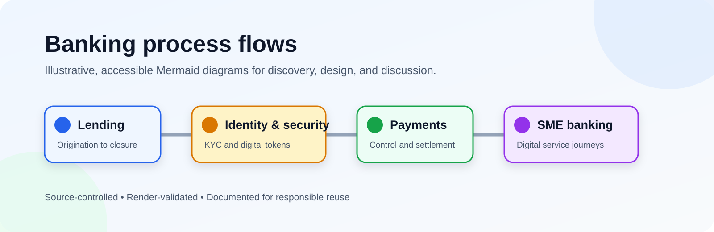

# Banking business-process flow diagrams

[](https://github.com/Xiang13-gif/business-process-flow-diagrams/actions/workflows/validate-diagrams.yml)

A curated library of **illustrative** banking-process diagrams, maintained as Mermaid source. It is designed for business analysts, product teams, consultants, and system designers who need a clear starting point for discussing workflows—not a substitute for a bank's approved procedures.

<p align="center">
  
</p>

## Start here

- Browse every diagram and preview in the [diagram catalog](docs/diagram-catalog.md).
- Read the [diagram design guide](docs/diagram-design-guide.md) before changing a flow.
- Use the [control and exception matrix](docs/control-and-exception-matrix.md) to turn a diagram into a reviewable control discussion.
- Look up shared terms in the [banking-process glossary](docs/banking-glossary.md).
- Start a new artifact from the reusable [process-design templates](templates/).
- See the [migration map](docs/migration.md) if you used the previous root-level paths.
- Review [sources, scope, and content-review expectations](docs/sources-and-review.md) before treating a diagram as factual.

## Diagram library

| Domain        | Diagram                                                                                                      | Focus                                                                | Companion guide                                                                              |
| ------------- | ------------------------------------------------------------------------------------------------------------ | -------------------------------------------------------------------- | -------------------------------------------------------------------------------------------- |
| Lending       | [Loan lifecycle](diagrams/lending/loan-lifecycle.mmd)                                                        | Origination through servicing, collections, and closure              | [Guide](docs/explanations/lending/loan-lifecycle.md)                                         |
| Lending       | [Retail credit application](diagrams/lending/retail-credit-application.mmd)                                  | Retail application, credit assessment, approval, and disbursement    | [Guide](docs/explanations/lending/retail-credit-application.md)                              |
| Lending       | [Auto-financing application](diagrams/lending/auto-financing-application.mmd)                                | Vehicle-finance application and underwriting journey                 | [Catalog notes](docs/diagram-catalog.md#auto-financing-application)                          |
| Lending       | [Credit-application workflow](diagrams/lending/credit-application-workflow.mmd)                              | Portfolio, prescreening, analysis, and multi-tier approval           | [Catalog notes](docs/diagram-catalog.md#credit-application-workflow)                         |
| Lending       | [Loan origination to servicing](diagrams/lending/loan-origination-to-servicing.mmd)                          | Handover from loan origination to account servicing                  | [Guide](docs/explanations/lending/loan-origination-to-servicing.md)                          |
| Lending       | [Loan handoff drill-down](diagrams/lending/loan-origination-to-servicing-handoff-drilldown.mmd)              | Conditions, booking, disbursement release, and servicing activation  | [Catalog notes](docs/diagram-catalog.md#loan-origination-to-servicing-handoff-drill-down)    |
| Lending       | [Collections and hardship management](diagrams/lending/collections-and-hardship-management.mmd)              | Arrears triage, customer engagement, relief options, and resolution  | [Catalog notes](docs/diagram-catalog.md#collections-and-hardship-management)                 |
| Accounts      | [Retail account opening and activation](diagrams/accounts/retail-account-opening-and-activation.mmd)         | Application, due diligence, account setup, funding, and activation   | [Catalog notes](docs/diagram-catalog.md#retail-account-opening-and-activation)               |
| Accounts      | [Account maintenance and closure](diagrams/accounts/account-maintenance-and-closure.mmd)                     | Servicing requests, closure controls, final balance, and records     | [Catalog notes](docs/diagram-catalog.md#account-maintenance-and-closure)                     |
| Cards         | [Credit-card application and activation](diagrams/cards/credit-card-application-and-activation.mmd)          | Application, assessment, issuance, delivery, and secure activation   | [Catalog notes](docs/diagram-catalog.md#credit-card-application-and-activation)              |
| Identity      | [KYC onboarding](diagrams/identity/kyc-onboarding.mmd)                                                       | Customer due diligence, screening, risk review, and monitoring       | [Guide](docs/explanations/identity/kyc-onboarding.md)                                        |
| Identity      | [KYC screening and EDD drill-down](diagrams/identity/kyc-screening-and-edd-drilldown.mmd)                    | Screening triage, enhanced due diligence, and case disposition       | [Catalog notes](docs/diagram-catalog.md#kyc-screening-and-enhanced-due-diligence-drill-down) |
| Security      | [Digital-token activation](diagrams/security/digital-token-activation.mmd)                                   | Step-up verification, device binding, and activation                 | [Guide](docs/explanations/security/digital-token-activation.md)                              |
| Security      | [Fraud-alert investigation and resolution](diagrams/security/fraud-alert-investigation-and-resolution.mmd)   | Detection, triage, customer contact, review, and case closure        | [Catalog notes](docs/diagram-catalog.md#fraud-alert-investigation-and-resolution)            |
| Payments      | [Corporate bulk payment](diagrams/payments/corporate-bulk-payment.mmd)                                       | File upload, maker-checker approval, bank processing, and reporting  | [Guide](docs/explanations/payments/corporate-bulk-payment.md)                                |
| Payments      | [Corporate single payment](diagrams/payments/corporate-single-payment.mmd)                                   | Manual transfer, maker-checker approval, settlement, and reporting   | [Guide](docs/explanations/payments/corporate-single-payment.md)                              |
| Payments      | [Maker-checker approval drill-down](diagrams/payments/maker-checker-payment-approval-drilldown.mmd)          | Preparation, approval limits, expiry, escalation, and release        | [Catalog notes](docs/diagram-catalog.md#maker-checker-payment-approval-drill-down)           |
| Payments      | [Payment dispute and chargeback management](diagrams/payments/payment-dispute-and-chargeback-management.mmd) | Dispute intake, evidence review, representment, outcome, and closure | [Catalog notes](docs/diagram-catalog.md#payment-dispute-and-chargeback-management)           |
| Trade finance | [Documentary credit issuance and settlement](diagrams/trade/documentary-credit-issuance-and-settlement.mmd)  | Application, issuance, document review, settlement, and closure      | [Catalog notes](docs/diagram-catalog.md#documentary-credit-issuance-and-settlement)          |
| SME banking   | [SME digital-banking journey](diagrams/sme/sme-digital-banking-journey.mmd)                                  | Onboarding, payments, collections, financing, trade, and servicing   | [Guide](docs/explanations/sme/sme-digital-banking-journey.md)                                |
| Architecture  | [Banking system context and data lineage](diagrams/architecture/banking-system-context-and-data-lineage.mmd) | Channels, services, controls, systems of record, and downstream data | [Catalog notes](docs/diagram-catalog.md#banking-system-context-and-data-lineage)             |
| State model   | [Credit application states](diagrams/states/credit-application-state-machine.mmd)                            | Explicit lifecycle states, reversals, and terminal outcomes          | [Catalog notes](docs/diagram-catalog.md#credit-application-state-machine)                    |
| State model   | [Corporate payment states](diagrams/states/corporate-payment-state-machine.mmd)                              | Approval, screening, funding, execution, and return states           | [Catalog notes](docs/diagram-catalog.md#corporate-payment-state-machine)                     |

The conceptual [approval-matrix reference](docs/reference/approval-matrix.md) is available separately because it describes a control pattern rather than one diagram.

## Process-design toolkit

- [Control and exception matrix](docs/control-and-exception-matrix.md): map each important decision, exception, owner, and evidence item behind a diagram.
- [Banking-process glossary](docs/banking-glossary.md): use consistent, plain-language terminology across diagrams and guides.
- [Templates](templates/): start a process brief, control matrix, or companion guide without rebuilding the structure from scratch.

For a dense workflow, pair a high-level diagram with one or more drill-downs and a control matrix. The architecture and state-model diagrams show complementary views: system/data boundaries and lifecycle transitions, respectively.

## View, validate, and render

The committed SVG previews make the library easy to browse on GitHub. Mermaid (`.mmd`) files remain the source of truth.

```bash
pnpm install
pnpm run check
pnpm run render:diagrams
```

`pnpm run check` verifies formatting, local links, required accessibility metadata, Mermaid renderability, and that every committed SVG preview carries the current Mermaid-source hash. `pnpm run render:diagrams` refreshes the committed SVG previews in `assets/previews/`.

## Scope and responsible use

- These are conceptual examples for discussion and analysis. They are **not** official documentation for any bank, provider, product, payment scheme, regulator, or named platform.
- Do not use them as a production procedure, compliance rule, approval authority, or customer instruction without review by the relevant owner.
- Never add real customer data, credentials, account numbers, internal URLs, or confidential process details.
- Names and trademarks belong to their respective owners; their appearance does not imply affiliation or endorsement.

## Contributing and security

Contributions are welcome—start with [CONTRIBUTING.md](CONTRIBUTING.md). Report suspected repository vulnerabilities according to [SECURITY.md](SECURITY.md), not in a public issue.

## License

No license has been selected for this repository yet. Copyright remains with the repository owner by default, so ask for permission before reusing material. A future maintainer may choose an explicit license once the intended reuse terms are agreed.
